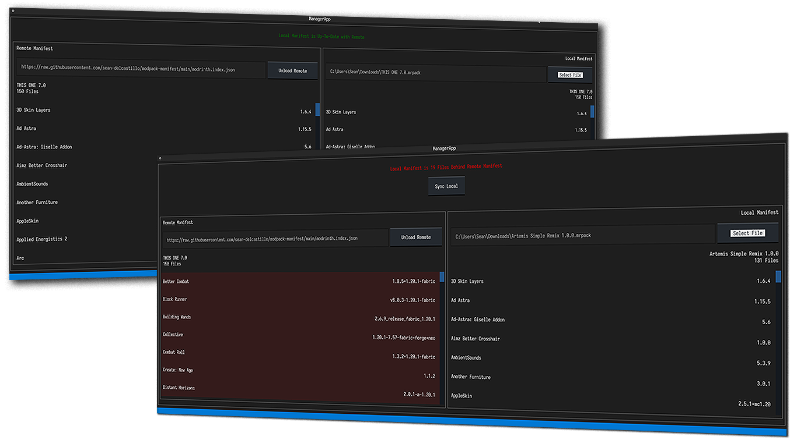

# Manifest Manager



A TUI (Terminal User Interface) utility to manage a Modrinth manifest file (.mrpack).

## Installation

### Vanilla Python

Install requirements

```sh
pip install -r requirements.txt
```

Run Manifest Manager

```sh
python manifest-manager.py
```

### Poetry

Ensure [Poetry](https://python-poetry.org/) is installed

```sh
pipx install poetry
```

---

> Poetry should always be installed in a dedicated virtual environment to isolate it from the rest of your system. It should in no case be installed in the environment of the project that is to be managed by Poetry. This ensures that Poetry’s own dependencies will not be accidentally upgraded or uninstalled. (Each of the following installation methods ensures that Poetry is installed into an isolated environment.) In addition, the isolated virtual environment in which poetry is installed should not be activated for running poetry commands.

- From Poetry's Installation Docs

---

Run Manifest Manager Through Poetry's Virtual Environment

```sh
poetry run python manifest-manager.py
```

### Windows Executable

Download the Windows binary from releases and double click. Built using [PyInstaller](https://pyinstaller.org/en/stable/)

### Wheel File

Download the [Wheel](https://packaging.python.org/en/latest/specifications/binary-distribution-format/#binary-distribution-format) file from releases

```sh
pip install manifest_manager-0.1.0-py3-none-any.whl
```

Run Manifest Manager

```sh
python manifest-manager.py
```

## Usage

### Remote Manifest

Accepts a web URL that returns a JSON file that matches the format of Modrinth's mrpack `manifest.index.json` file.

### Local Manifest

Accepts a local path of a mrpack file.

### Syncing

If the file lists of the two loaded manifests are different then an option to pull the remote manifest down to sync the local manifest is available. This will copy the whole remote `manifest.index.json` file to the local mrpack file. However, this should preserve the local overrides.
